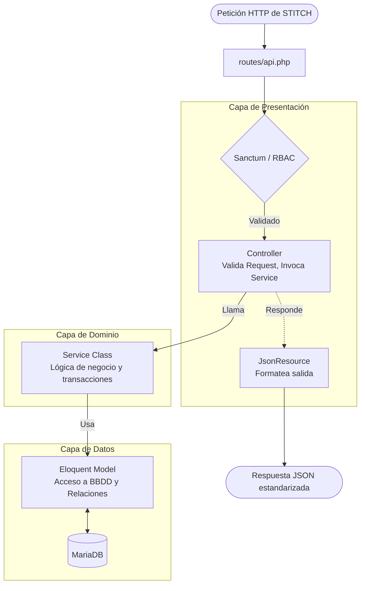

# Implementation Plan: booking-backend

**Branch**: `001-booking-backend` | **Date**: 2026-06-25 | **Spec**: [spec.md](file:///C:/Users/Asus%20TUF/Desktop/DMGOTRAVEL/specs/001-booking-backend/spec.md)

**Input**: Feature specification from `specs/001-booking-backend/spec.md`

## Summary

Construir un backend robusto en Laravel bajo una arquitectura en capas (Controladores, Servicios, Modelos, Recursos) para gestionar servicios turísticos y reservas. El backend actuará como una API RESTful consumida exclusivamente por un frontend pre-diseñado en STITCH a través del Model Context Protocol (MCP).

## Technical Context

**Language/Version**: PHP 8.2+

**Primary Dependencies**: Laravel 11, Laravel Sanctum (Auth), spatie/laravel-permission (RBAC)

**Storage**: MariaDB 10.6+

**Testing**: PHPUnit, Laravel Testing Utils

**Target Platform**: Web Service (API REST) integrándose con STITCH vía MCP

**Project Type**: web-service

**Performance Goals**: Tiempos de respuesta API < 300ms para endpoints CRUD.

**Constraints**:
- Cumplimiento estricto ACID y claves foráneas.
- Toda la lógica de negocio debe aislarse en la Capa de Servicios.
- No renderizar vistas Blade; todas las respuestas deben ser JSON a través de `JsonResource`.
- STITCH maneja toda la UI/UX. El proyecto en STITCH tiene el nombre DMGOTRAVEL.

**Scale/Scope**: MVP central de gestión de reservas, con roles de Administrador y Cliente.

## Constitution Check

*GATE: Must pass before Phase 0 research. Re-check after Phase 1 design.*

- [x] **Gate 1 — Arquitectura:** Controladores delgados, lógica en servicios, respuestas vía JsonResource.
- [x] **Gate 2 — Datos:** Migraciones con claves foráneas, SoftDeletes en todos los modelos.
- [x] **Gate 3 — Seguridad:** Endpoints protegidos con Sanctum + permisos spatie.
- [x] **Gate 4 — Pruebas:** ≥80% cobertura en Capa de Servicios.
- [x] **Gate 5 — Formato:** PSR-12 vía Laravel Pint.
- [x] **Gate 6 — Errores:** Respuestas estandarizadas (422/403/404/500).
- [x] **Gate 7 — Integración STITCH:** API 100% consumible.

## Project Structure

### Documentation (this feature)

```text
specs/001-booking-backend/
├── plan.md
├── research.md
├── data-model.md
├── quickstart.md
├── contracts/
│   ├── auth.md
│   ├── admin.md
│   └── client.md
└── tasks.md
```

### Source Code (repository root)

```text
app/
├── Http/
│   ├── Controllers/
│   │   ├── Api/
│   │   │   ├── Admin/
│   │   │   ├── Client/
│   │   │   └── Public/
│   │   ├── Requests/
│   │   └── Resources/
├── Models/
└── Services/
    ├── Auth/
    ├── Booking/
    └── Catalog/

database/
├── migrations/
└── seeders/

routes/
└── api.php

tests/
├── Feature/
└── Unit/
    └── Services/
```

**Structure Decision**: Monolito Laravel API-only (Web Service) estructurado en capas lógicas dentro de `app/`, con separación explícita de namespaces para Admin, Client y Public en los controladores para alinearse con los flujos de STITCH.

## Layer Responsibilities Diagram



## Complexity Tracking

No constitution violations detected. No complexity justification needed.
